### Escuela Colombiana de Ingeniería
### Arquitecturas de Software - ARSW

## Escalamiento en Azure con Maquinas Virtuales, Sacale Sets y Service Plans

### Dependencias
* Cree una cuenta gratuita dentro de Azure. Para hacerlo puede guiarse de esta [documentación](https://azure.microsoft.com/es-es/free/students/). Al hacerlo usted contará con $100 USD para gastar durante 12 meses.
Antes de iniciar con el laboratorio, revise la siguiente documentación sobre las [Azure Functions](https://www.c-sharpcorner.com/article/an-overview-of-azure-functions/)

### Parte 0 - Entendiendo el escenario de calidad

Adjunto a este laboratorio usted podrá encontrar una aplicación totalmente desarrollada que tiene como objetivo calcular el enésimo valor de la secuencia de Fibonnaci.

**Escalabilidad**
Cuando un conjunto de usuarios consulta un enésimo número (superior a 1000000) de la secuencia de Fibonacci de forma concurrente y el sistema se encuentra bajo condiciones normales de operación, todas las peticiones deben ser respondidas y el consumo de CPU del sistema no puede superar el 70%.

### Escalabilidad Serverless (Functions)

1. Cree una Function App tal cual como se muestra en las  imagenes.

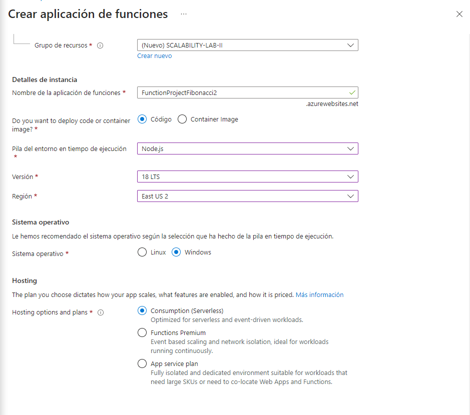

2. Instale la extensión de **Azure Functions** para Visual Studio Code.

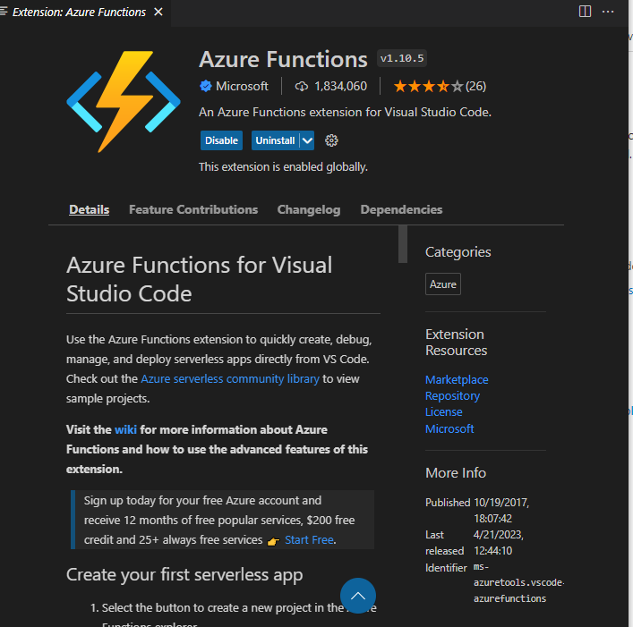

3. Despliegue la Function de Fibonacci a Azure usando Visual Studio Code. La primera vez que lo haga se le va a pedir autenticarse, siga las instrucciones.

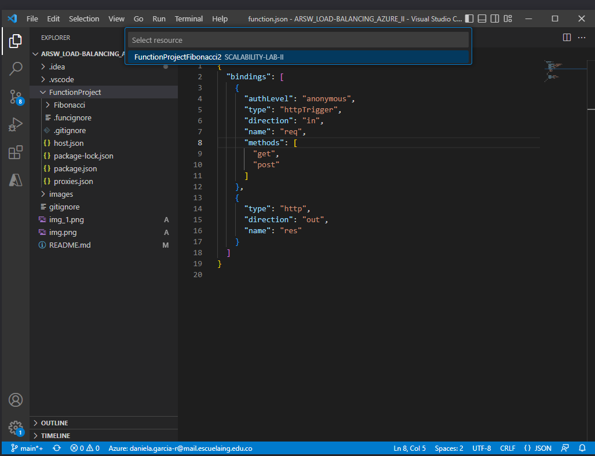

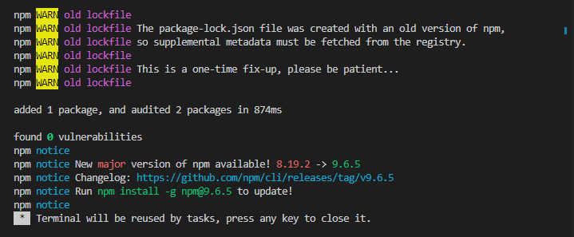

4. Dirijase al portal de Azure y pruebe la function.

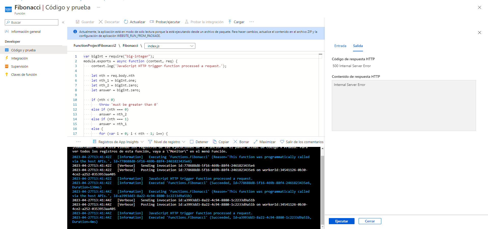

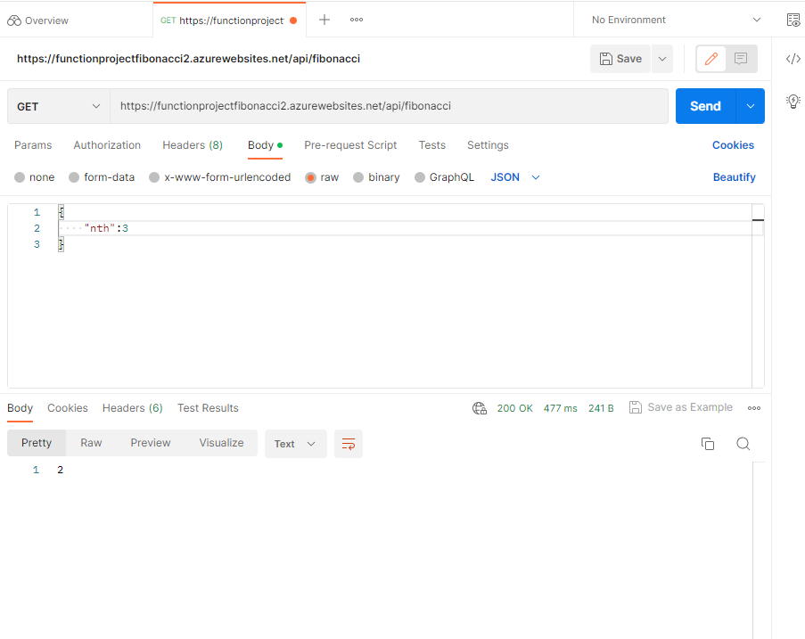

5. Modifique la coleción de POSTMAN con NEWMAN de tal forma que pueda enviar 10 peticiones concurrentes. Verifique los resultados y presente un informe.
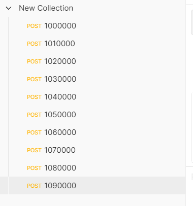

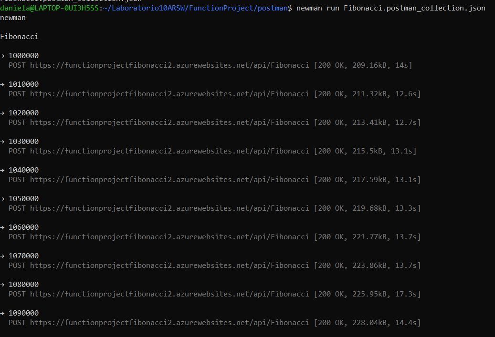

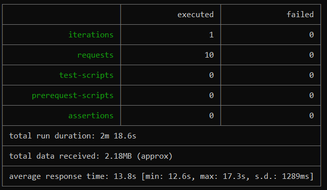

6. Cree una nueva Function que resuleva el problema de Fibonacci pero esta vez utilice un enfoque recursivo con memoization. Pruebe la función varias veces, después no haga nada por al menos 5 minutos. Pruebe la función de nuevo con los valores anteriores. ¿Cuál es el comportamiento?.

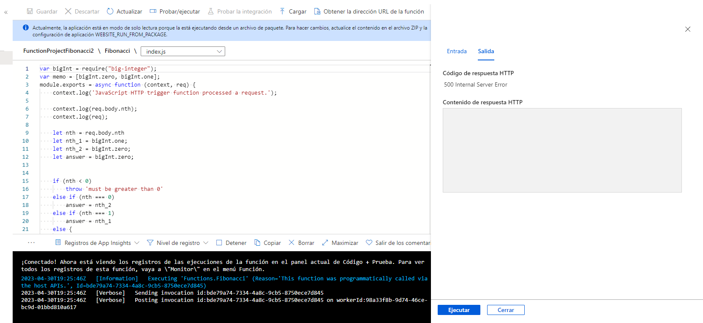

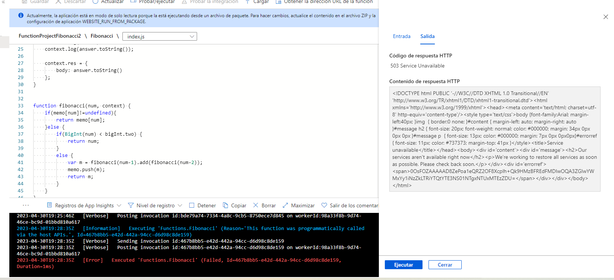

**Preguntas**

* ¿Qué es un Azure Function?

Azure Functions es un servicio en la nube disponible a petición que proporciona toda la infraestructura y los recursos, que se actualizan continuamente, necesarios para ejecutar las aplicaciones. Usted se centra en los fragmentos de código que más le importan y Functions se ocupa del resto. Functions proporciona proceso sin servidor para Azure. Functions también se puede usar para crear API web, responder a los cambios en las bases de datos, procesar secuencias de IoT, administrar colas de mensajes, etc.
* ¿Qué es serverless?

Serverless se refiere a una computacion sin servidor, es decir un modelo en el cual el proveedor de la nube es el responsable de asignar los recursos necesarios para la ejecucion de las aplicaciones o fragmentos de codigo.

* ¿Qué es el runtime y que implica seleccionarlo al momento de crear el Function App?

El runtime actua como un sistema operativo pequeño que provee todos los recursos necesario para la ejecucion de las aplicaciones. Al momento de crear la Function App al elegir el runtime, le indicamos al programa que recursos requerimos para que nuestra aplicacion corra.
* ¿Por qué es necesario crear un Storage Account de la mano de un Function App?

La cuenta de almacenamiento proporciona un espacio de nombres único para los datos de Azure Storage que es accesible desde cualquier lugar del mundo mediante HTTP o HTTPS. Los datos de la cuenta de almacenamiento son duraderos y altamente disponibles, seguros y escalables a gran escala.

* ¿Cuáles son los tipos de planes para un Function App?, ¿En qué se diferencias?, mencione ventajas y desventajas de cada uno de ellos.

Plan de consumo

Escale de forma automática y pague los recursos de proceso solo cuando se ejecuten las funciones.  
En el plan de consumo, las instancias del host de Functions se agregan y quitan de forma dinámica según el número de eventos de entrada.  
* Plan de hospedaje predeterminado.  
* Pague solo cuando se ejecutan las funciones.  
* Escala de forma automática, incluso durante períodos de carga elevada.

Plan Premium  
Escala automáticamente en función de la demanda mediante trabajos preparados previamente que ejecutan aplicaciones sin ningún retraso después de estar inactivas, ejecuta en instancias más eficaces y se conecta a redes virtuales.  
Considere la posibilidad de elegir el plan Premium de Azure Functions en las siguientes situaciones: 

* La aplicación de funciones se ejecuta de forma continua, o casi continua.  
* Tiene un gran número de ejecuciones pequeñas y una factura de ejecución elevada, pero pocos GB por segundo en el plan de consumo.  
* Necesita más opciones de CPU o memoria de las que proporciona el plan de consumo.  
* Su código debe ejecutarse durante más tiempo del máximo permitido en el plan de consumo.  
* Necesita características que no están disponibles en el plan de consumo, como la conectividad con red virtual.  
  
Plan dedicado  

Ejecute las funciones en un plan de App Service a los Precios de App Service normales. Mejor para escenarios de ejecución prolongada en los que no se puede usar Durable Functions. Considere el plan de App Service en las situaciones siguientes:  

* Tiene máquinas virtuales infrautilizadas que ya ejecutan otras instancias de App Service.  
* Quiere proporcionar una imagen personalizada en la que ejecutar sus funciones.  
* Se requieren escalado y costos predictivos. 

* ¿Por qué la memoization falla o no funciona de forma correcta?

La memoization falla debido a que los numeros son demasiado grandes, lo cual hace que el almacenamiento en cache empiece a llenarse y hacer que la aplicacion falle.

* ¿Cómo funciona el sistema de facturación de las Function App?

Consumo  
El plan de consumo de Azure Functions se factura en función del consumo de recursos y las ejecuciones por segundo. Los precios del plan de consumo incluyen una concesión gratuita mensual de 1 millones de solicitudes y 400.000 GB-segundos de consumo de recursos por suscripción en el modelo de precios de pago por uso, para todas las aplicaciones de funciones de esa suscripción. El plan Azure Functions Premium proporciona un rendimiento mejorado y se factura por segundo en función del número de vCPU/s y de GB/s que consuman sus funciones premium. Los clientes también puede ejecutar Functions dentro de su plan de App Service a las tarifas normales del plan de App Service.

